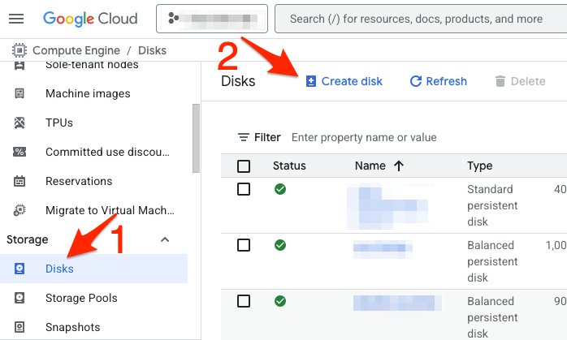
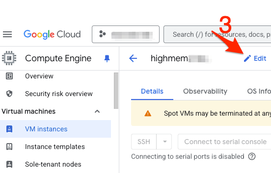
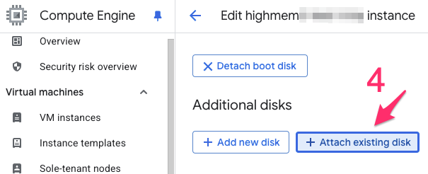
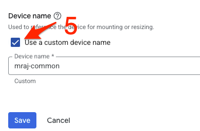

# using rstudio and jupyterlab on gcp VMs with a portable personal disk

## 0. quick look up for routinely commands (after initial setup) 

Here's a [list of routinely used commands](/docs/postsetup.md) to use after initial setup. For initial setup, proceed to next step.

## 1. create a personal disk
- use gcp web ui to create a personal disk. This disk will hold all your data (being activly analyzed, not archival) and R libraries. Also, this disk can be resized later if needed.

<p align="center">

</p>

- attach personal disk to highmem machine (use gcp web ui)
    - while creating, check the box for custom name
<p float="left">
    
    
</p>
<p align="center">
    
</p>

- log in to VM: `highmem1` in project `macosko-lab`. Use either web consle or [google cloud CLI](https://cloud.google.com/sdk/docs/install).
- format disk using following command. Do this **only ONCE** right after disk creation.
    ```
    formatdisk <disk-name>
    ```
- this disk is resizable and can be resized via gcp web ui if needed via web gui and the following command.
    ```
    refreshdisk <disk-name>
    ```

- see the following docs to start a prebuilt container image for rstudio,
jupyter lab, or your own custom container image. Both rstudio and jupyter can
containers can be start simultaneously if needed; each can be accessed via a
seperate port.

## 2. to start rstudio

See [rstudio docs](/docs/rstudio.md)

## 3. to start jupyter

See [jupyter docs](/docs/jupyter.md)

## 4.  to start a custom docker image

See [custom image docs](/docs/custom.md)

## 5. stopping containers

After work is completed, the following commands can be used to stop the container and release reserved system resourses.

`rstudio-stop` : stop rstudio session 

`jupyter-stop` : stop running jupyter lab session

`all-stop` : stop all jupyter or rstudio sessions (that have text '*jupyter*' or '*rstudio*' as part of the underlying container container name)

