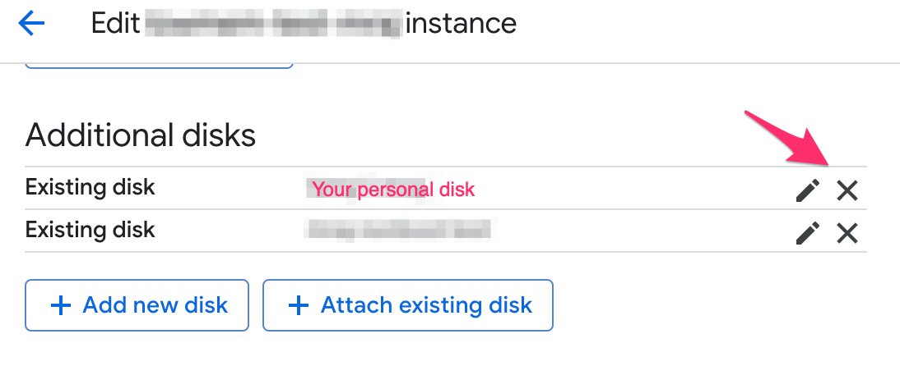
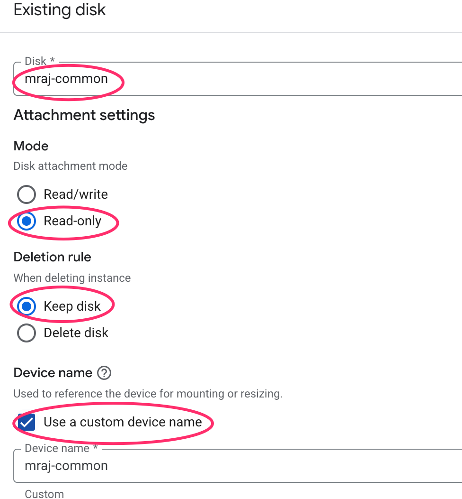
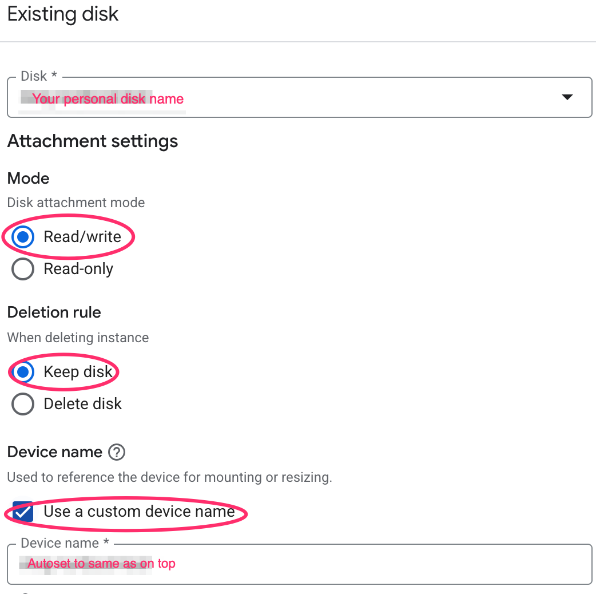

### one time initial setup on personal VM

- unmount personal disk from `highmem1` machine if currently mounted. Run following command on a `highmem1` console.
    ```
    unmountdisk <disk-name>
    ```
- detach personal disk from VM `highmem1` machine if currently attached (use gcp web ui)
<p align="center">

</p>

- create a personal VM. While creating it, set *./src/startup-instance.sh* as the startup script for the VM.
- attach disk `common-mraj` to personal VM via web ui in read only mode. This disk contains prebuild container images to get started quickly. Check the highlighted values when attaching disk.

<p align="center">

</p>

- attach personal disk to personal VM  (use gcp web ui). Ensure highlighted values match, in particular, mode is different from above - it should be `Read/write`.

<p align="center">

</p>

- log in to personal vm
- mount personal disk using following command. Run following command on a personal VM console.
    ```
    mountdisk <disk-name>

- ensure your userid on the personal VM is same as in the shared VM by entering the following command on both machines. If your userid is different on both machines, see [appendix](/docs/appendix.md) to change userid on your *personal* VM
    ```
    id -u
    ```
- vm setup
    ```
    sudo apt update
    sudo apt install git -y
    git clone https://github.com/MacoskoLab/macosko-compute
    cd macosko-compute
    bash ./src/setup-instance.sh
    ```
- (optional) if contents of your personal disk is not visible at `/mnt/disks/$USER` after a reboot, enter `remount` (no arguments needed) to remount the personal disk. Note that your personal disk should have been mounted at least once before via `mountdisk` for remount to work.
    
- continue with [rstudio](/docs/rstudio.md) or [jupyter](/docs/jupyter.md) doc.
